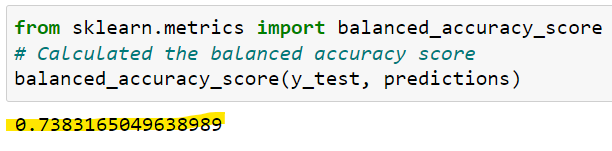
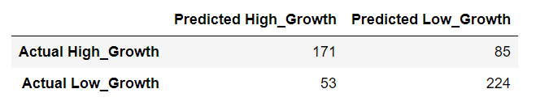
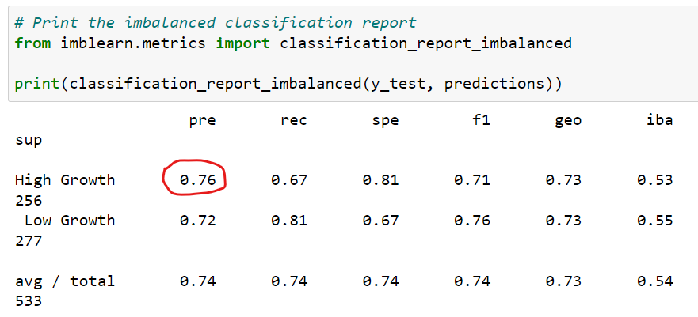
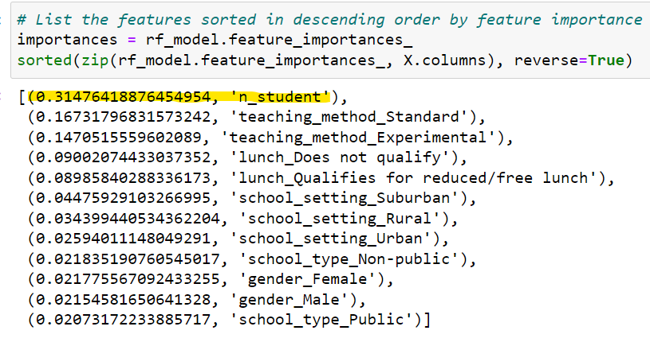

# Final Project: Predicting Growth in Test Scores - Segment Two

# Communication Protocols
The project team consisted of Pa Lor, Eric Sanders and Sue Yang. The team's primary communication method was through a private Slack message. After each group meeting, notes were shared with project assignments and responsibilities to make sure everyone left the meeting with a clear understanding of their action items and tasks to complete before the next meeting. The team established a desire to use office hours before class to discuss any questions and items that needed cross consultation and discussion among team members. A standing Saturday meeting time was also established for the team to utilize as needed to finish tasks for submission.

# Resources
The tools used for our project:
* Python
* PostgreSQL
* Tableau
* VS Code
* Jupyter Notebook
 
# Project Overview 
  
As the pandemic resides and schools return to some level of normalcy, academic performance data, specifically data on environmental factors contributing to a student’s academic test scores, will be crucial for evaluating how to get students back on track academically.

The questions we hope to answer are:
1. Based on environmental factors such as school setting, school type, teaching method, classroom size, and socio-economic status(indicated by lunch status), can we predict whether a student will have high or low growth in their test scores (pre-test compared to post-test scores)?
2. Which of the factors assess are the most important in determining a student’s growth?

The dataset used for this project was pulled from Kaggle and linked [here](https://www.kaggle.com/datasets/kwadwoofosu/predict-test-scores-of-students).

### Initial Data Exploration & Analysis
Very little cleaning was needed for our dataset. Descriptive statistics were generated to understand makeup of dataset. This was completed for the whole dataset and for each school setting (urban, suburban, and rural).To measure growth in test scores, we calculated % change in score from pre- to post-test. Then used that data to determine if a student experienced high or low growth. Based on the mean for % change in test scores (about 18.5), we decided to go with 18.5 points as our cut-off score for determining our high and low growth categories.

# Machine Learning Model
The model we decided to use for our machine learning was a random forest classifier. We chose this model because the ensemble features of this model allowed us to find the importance of each feature in our model. This was important since we wanted to know the ranking and importance of each feature on predicting a student’s growth in their test scores.

The limitations of our a random forest model include:
* Small data set - with a small sample size and few features are correlated with the outcome which can be dififcult to get accurate predictions. We believe this doesn't apply to our dataset because after dropping certain non-relevant features there were several left with good correlative value.
* Training time and resource allocation (in the event of a large dataset) - Random Forest creates a lot of trees and requires more computation power and resources. It requires more time to train. 

The benefits of a random forest model include:
* The Random Forest algorithm has built-in feature importance which will allow us to rank the importance of our features we are using to predict our dependent variable - level of growth in test scores.
* Works well with categorical & continuous variables
* Robust to outliers

### Preliminary Data Preprocessing
Our dataset was pretty clean already and we did not have to do much data cleanup in our preprocessing. As we were interested in predicting the impact of environmental factors on a student’s growth in test scores (from pre- to post-test), we calculated the percent change for each student. From there we defined the categories of whether a student fell into the low or high growth category. Lastly, we performed pd.get_dummies to convert all of our categorical features and columns into numerical encoders.

### Preliminary Feature Engineering and Feature Selection
We did not include pre-test and post-test scores as a feature as those two columns were more of benchmarks and results. Information from those two columns did not tell us anything about a student’s growth from their pre-to post-test score but were rather just outcomes and benchmarks. The other data in our dataset were indicative of what we consider to be environmental factors (classroom size, school setting,

Minimal preliminary data preprocessing was needed. We created low and high growth groups for our target variable. To determine the groups, we calculated the percentage change between the pre-test and post-test score for each student. Then based on our exploratory data analysis and descriptive statistics, we discovered 18.63% was the mean for the percentage change. We created a function to use 18.63% as the cut off. Any student who had more than an 18.63% change in their test score as categorized as high growth and anyone below that number was considered low growth. Our features were school setting, school, type, teaching method, number of students, gender and lunch status. Then because some of our features and variables were categorical, we used pd.get_dummies to convert our categorical variables into numerial encoders.

### Splitting Data into Training and Testing Sets
The count balance between Low Growth and High Growth was pretty evenly split (1128 feel into Low Growth category and 1005 fell into High Growth category). Since we had an even split between the two groups, we did not need to stratify or standardize our dataset. We used the standard 80/20 split for splitting our dataset into training and testing sets.

# Database Integration
We used Postgres SQL as our database and built a connection string to pull our dataset from Postgres. The two tables we created were comprised of student information and school information. Both tables were merged into a combined table.

# Dashboard
Dashboard will be developed on Tableau and displayed as a webframe on a Heroku app. The innteractive elements of our dashboard will include user selections for toggling on or off the different features of interest in our dataset:
* School setting
* Lunch status
* School type
* Teaching method

### Screenshots from initial visualizations and Prototype Dashboard

This view shows school setting (urban, suburban, and rural) plus school setting type.  We initially hypothesized that whether a student qualifies for a free or reduced lunch would have a larger impact on the pre-test to post-test score.  Variance is shown here and we can see that the greatest variance occurs in the urban setting where students do qualify for free or reduced lunches.

This bar graph brings together what appear to be the main influencing features from our dataset along with filters to allow the user to single out different sets of information.

Our initial dashboard view attempts to call out the main features that would first be considered including the number of students in the dataset and the split between public and non-public schools.  Other relevant features consistent with our machine learning model include teaching method and free or reduced lunch qualification status.

# Results
From our machine learning model, the accuracy score was determined to be 73.8%. Our team determined this to be good enough for this model. We tried other various iteration but did not get a higher score than this. 

Here's a snapshot of our confusion matrix:

Based on our classification report, our precision score for high growth stated that of all the predicted high growth, we were able to correctly identify 76% of them. 

Base on the feature importance, it was determined that the number of students within the classroom was the biggest indicator of whether or not a student will show high growth. This feature impact was over 30% and well above all the other features.

# Recommendations for future analysis
Upon completion of our analysis with the data, here are some recommendations on future investigations with the dataset:
- Explore other similar and more robust dataset that have higher row values and wider feature inputs
- Do a correlation predcition using linear regression on pre and post test
- Explore feature components to see why they may/may not be important in the score growth
- Explore feature importance based on specific populations

## What we would do differently based on our experience
- Establish a better framework to guide our selection of a dataset
- Explore additional machine learning models during the initial phase of the project
- Create multiple branches and learn how to merge changes onto the main branch
